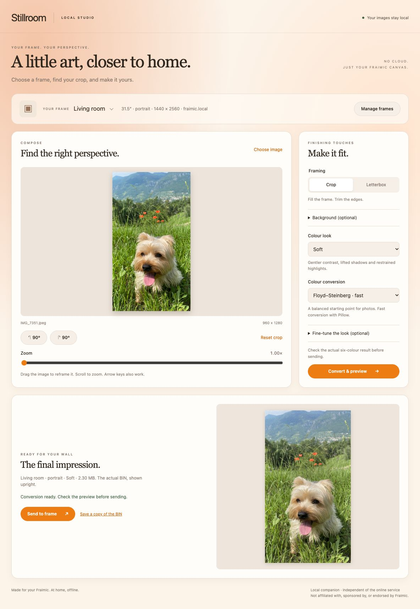

# Stillroom

A local image preparation app for Fraimic frames, with a Spectra 6 `.bin` converter.
Choose a frame, crop and rotate your image, adjust its colours, preview the
six-colour result, and send it to your frame over your local network. Images are
processed on the computer running Stillroom; no cloud service or online account
is required.

The interface supports Fraimic 13.3-inch and 31.5-inch frames. The command-line
converter remains available for individual images and batch processing.

Stillroom is an independent open-source companion, not affiliated with, sponsored
by, or endorsed by Fraimic. It builds on the
[original Fraimic converter](https://github.com/Fraimic/fraimic_bin_converter).



## Why Stillroom?

Stillroom started with a simple wish: an intuitive way to prepare images and send
them to a Fraimic canvas over the local network, without relying on a cloud service.

Built on [Fraimic’s original converter](https://github.com/Fraimic/fraimic_bin_converter)
and incorporating the uploader and preview tools contributed by
[corrin](https://github.com/corrin) in
[pull request #1](https://github.com/Fraimic/fraimic_bin_converter/pull/1),
this project was “vibe coded” with ChatGPT. It brings those foundations together
in a local graphical interface, as an independent companion to Fraimic’s hardware.

I’m sharing it in the hope that other Fraimic owners will find it useful—or find
something worth building on. Feel free to fork it and make it your own. My spare
time for maintaining and improving it is… more than limited. 😅

## Contents

- [Why Stillroom?](#why-stillroom)
- [Requirements](#requirements)
- [Installation](#installation)
- [First steps](#first-steps)
- [Guides](#guides)
- [Credits](#credits)
- [Contributing & maintenance](#contributing--maintenance)
- [License](#license)

## Requirements

- **Python 3.8 or newer**
- **Pillow 9.1 or newer**, plus `numpy` and `tqdm`
- Optional: `pillow-heif` (only for `.heic` input)

> Pillow must be **9.1+** — the converter uses the `Image.Dither` enum introduced in that
> release. Older versions fail with `AttributeError: module 'PIL.Image' has no attribute
> 'Dither'`.
>
> `pillow-heif` is optional. Without it the script runs normally for JPG, PNG, etc. and simply
> disables `.heic` support.

## Installation

Clone this repository, then create a virtual environment and install the dependencies:

```bash
git clone https://github.com/WillCroPoint/stillroom.git
cd stillroom
python3 -m venv .venv
source .venv/bin/activate      # Windows: .venv\Scripts\activate
python -m pip install -r requirements.txt
python gui.py
```

A virtual environment is recommended: recent macOS (Homebrew) and Debian/Ubuntu Python
installs block a global `pip install` with `error: externally-managed-environment`.

For subsequent launches, activate the environment and run `python gui.py` from
the repository directory. Stillroom opens in your default browser.

## First steps

1. Wake your Fraimic frame and connect it to the same local network as Stillroom.
2. Open **Manage frames** and add a name, hostname or IP address, panel size and
   orientation. Save your frame settings.
3. Choose a photo, then crop, rotate and adjust its colours.
4. Select **Convert & preview** to inspect the actual six-colour result.
5. Select **Send to frame**, or **Save a copy of the BIN** to keep the converted file.

Keep the terminal running while using the interface. Stop it with **Ctrl+C** when
finished; closing the browser tab alone does not stop the server. Frame settings
are saved locally, while working images and previews are temporary.

The interface processes one image at a time (up to 60 MB and 40 megapixels).
For detailed controls, backgrounds and troubleshooting, see the
[user guide](docs/USER_GUIDE.md).

## Guides

| Guide | What you’ll find |
| --- | --- |
| [User guide](docs/USER_GUIDE.md) | Frame setup, cropping, colours, backgrounds, customization and troubleshooting |
| [Command-line tools](docs/CLI.md) | Conversion, batches, upload, previews and all command options |
| [Binary format](docs/BINARY_FORMAT.md) | Palette codes, panel layouts and binary specifications |
| [Docker / Unraid](deploy/README.md) | Container deployment, updates and Nginx configuration |

## Credits

Stillroom adds a local graphical workflow to the
[Fraimic image converter](https://github.com/Fraimic/fraimic_bin_converter)
and builds on prior open-source work:

- **[corrin](https://github.com/corrin)** — contributed the original `upload.py`
  and `decode_bin.py` scripts, together with their initial usage documentation, in
  **[Fraimic/fraimic_bin_converter PR #1 — Add REST API uploader (image → frame) and .bin preview tool](https://github.com/Fraimic/fraimic_bin_converter/pull/1)**.
  The versions included here have since been adapted and extended; this credit
  identifies their original contribution, not authorship of the subsequent changes.
- **[PhotoPainter E-Ink Spectra 6 image converter](https://github.com/Toon-nooT/PhotoPainter-E-Ink-Spectra-6-image-converter)**
  by Toon-nooT — for their tuned RGB + luma color-distance metric and the
  historical dithering now preserved in `legacy_dithering.py`.

## Contributing & maintenance

Bug reports and pull requests are welcome at
[WillCroPoint/stillroom](https://github.com/WillCroPoint/stillroom/issues).
For interface issues, include your operating system, Python version and steps
to reproduce. Remove private frame addresses and personal images from reports.

This is a spare-time project, so responses and updates may be slow. Forks and
contributions are welcome; please include reproduction steps for bug fixes and
explain the intended behaviour of proposed changes.

## License

This project is open source under the **MIT License** — see [LICENSE](LICENSE).
