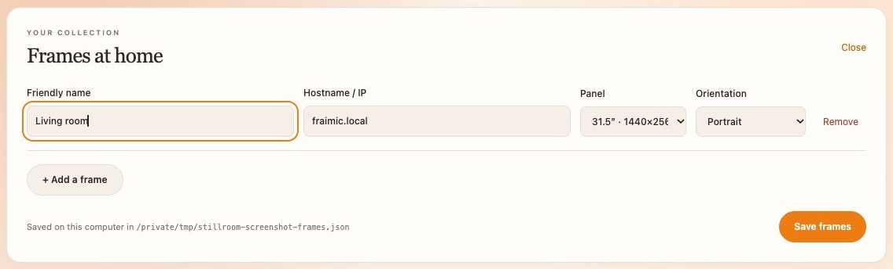
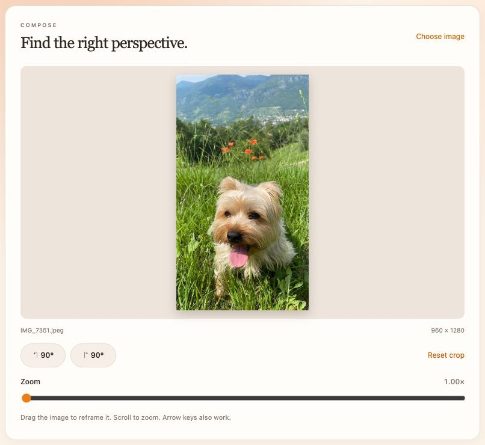
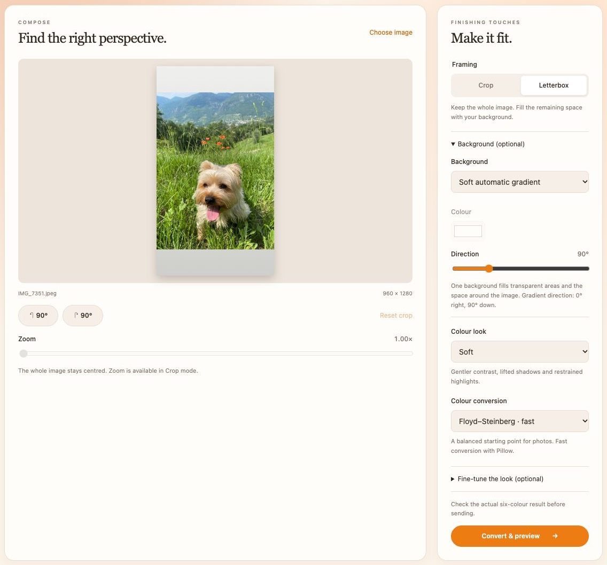
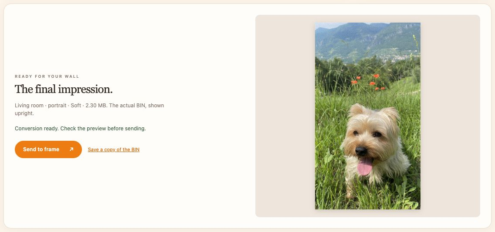

# Stillroom user guide

[← Back to the README](../README.md)

Install Stillroom using the [quick start](../README.md#installation). Run the
commands below from the repository directory with your Python environment active.

## Contents

- [Local graphical interface](#local-graphical-interface)
- [Image backgrounds](#image-backgrounds)
- [Colours and conversion](#colours-and-conversion)
- [Application name and independence](#application-name-and-independence)
- [Troubleshooting](#troubleshooting)

## Local graphical interface

With your Python environment activated, launch:

```bash
python gui.py
```

This opens **Stillroom** in your default browser. Everything stays on one
page: configure and select a frame, drop a JPG/PNG/HEIC photo, rotate it, choose
`crop` or `letterbox`, adjust the crop by dragging and zooming, convert, check the
upright six-colour preview, then send it to the selected frame.

No additional dependencies, web framework, build step, cloud service or account is
required. The Python server listens only on `127.0.0.1`. Keep the terminal running
while using the interface. HEIC uses the same optional `pillow-heif` dependency as
the command-line converter.

### Set up a frame

Open **Manage frames**, then choose **Add a frame**. Enter a friendly name and the
frame's hostname or IP address, choose its panel size and orientation, and select
**Save frames**. The example below uses a demonstration address; replace it with
your own frame's address.



*Choose the panel model and orientation to match your physical frame.*

Frame settings are saved in `frames.json` beside the script and ignored by Git.
See [`frames.example.json`](../frames.example.json) for the format. Changes made
by hand are loaded at the next application launch. A custom configuration path
can be selected with `-c`; the screenshot uses a temporary demonstration file.

### Crop and rotate

Select your frame and choose an image. In **Crop** mode, drag the photo inside the
fixed-ratio frame and scroll or use the **Zoom** slider. Arrow keys also reposition
the crop; Shift moves faster. Use the **90°** buttons to rotate the image and
**Reset crop** to return to the initial crop position and zoom.



*The portrait frame keeps the dog's ears and body visible, with room for the landscape.*

**Letterbox** keeps the whole image centred. The optional background controls fill
empty space or transparent areas with a solid colour or a soft gradient; see
[Image backgrounds](#image-backgrounds).

### Working files and launch options

Originals are untouched. Working images, previews and BINs are saved under the
system temporary directory and removed when you stop the application with Ctrl+C.
If interrupted during conversion, shutdown waits for the worker to finish.
Closing the browser tab alone does not stop the server. A page reload resets the
editor, while frame configurations remain saved. **Save a copy of the BIN** lets
you keep an export before shutdown.

Optional launch flags (also listed by `python gui.py -h`):

```bash
python gui.py -c /path/to/frames.json  # use another configuration file
python gui.py -p 8765                 # choose a fixed local port
python gui.py -n                      # print the URL without opening the browser
```

The editor accepts one image at a time, up to 60 MB and 40 megapixels. Use the [command-line tools](CLI.md) for batches. The graphical interface uses the same palette, enhancements,
dithering and binary packing as the CLI, with interactive crop positioning.

## Image backgrounds

Stillroom has one **Background (optional)** menu for both transparent pixels and
letterbox space: **Solid colour** (white by default) or **Soft automatic gradient**.
The gradient derives a muted tint from the visible subject and spans the entire
frame. Its direction is adjustable. No extra dependencies are required.

Controls stay in place: colour and direction are greyed out when not applicable.
For opaque images in Crop mode, no background is visible, so the background
controls are disabled with an explanation. Zoom and Reset crop remain visible
but disabled in Letterbox mode, which keeps the whole image in view.


To reproduce this example, select **Letterbox**, expand **Background (optional)**,
and choose **Soft automatic gradient**. Adjust **Direction** to change its angle.



*Letterbox preserves the whole photo; the automatic gradient fills the space above and below it.*

## Colours and conversion

Choose **Soft** for a gentler rendering, **Natural** to preserve the source colours,
or **Vivid** for stronger contrast and colour. **Original** reproduces the former
converter treatment. The six display colours cannot reproduce every source colour
exactly; always check the converted preview. Physical results also depend on the
panel and lighting.

Floyd–Steinberg is the fast default. Other methods offer different textures and
can be slower. See the [colour and dithering reference](CLI.md#options) for details.

### Preview and send

Select **Convert & preview**. Floyd–Steinberg is the fast default; the menu also
offers serpentine Floyd–Steinberg, Stucki, Sierra, classic Atkinson and optional
epd-dither. The final preview is decoded from the actual BIN, not just the source
photo. Changing any image or frame setting disables sending until you convert again.



*Check the actual converted image before sending it, or save the BIN for later.*

Wake the frame and connect to the same network, then select **Send to frame**.
Success means the device accepted the image; its physical display may still be
rendering. Failure details appear on the page and you can retry without reconverting.
The screenshot shows a conversion ready to send, not a completed transfer.

## Application name and independence

The application is named **Stillroom**, with **LOCAL STUDIO** as its interface label.
This is an independent open-source project for Fraimic-compatible frames, not
affiliated with, sponsored by, or endorsed by Fraimic. Fraimic is referenced to
identify compatible devices.

To choose a private display name, copy `branding.example.json` to
`branding.local.json` beside `gui.py`, then edit `app_name`. For example:

```json
{"app_name": "Fraimic Studio"}
```

Restart the application to apply changes. This file is ignored by Git and excluded
from the Docker build. Do not include it in public release archives or future
macOS bundles. The public default is centralized in `branding.py`.

`STUDIO_APP_NAME` overrides the local file, for example:

```bash
STUDIO_APP_NAME="My Image Studio" python gui.py
```

For Docker/Unraid, set `STUDIO_APP_NAME="My Image Studio"` in
`deploy/docker/.env`, then run `./deploy/manage.sh apply`. An empty value uses the public default in Docker; outside Docker it falls back
to the local branding file if present, then the public default.
The name appears in the page title, header and server startup/shutdown messages.
The non-affiliation notice always stays visible, regardless of the display name.
Frame settings, URLs, container names and storage locations remain stable.
A future macOS packager can use the same `load_app_name` helper; no macOS bundle
is built by this repository yet.

### Appearance

Edit `web/style.css` to customize the palette, fonts and border radius in its
opening `:root` block. HTML and behaviour are separate in `web/index.html` and
`web/app.js`. The cream/peach background, serif headings and orange controls take
inspiration from Fraimic's sign-in page; no remote assets are loaded.

## Troubleshooting

- **The page does not open:** keep the terminal running and open the URL it prints.
  Use `python gui.py -n` to print the URL without launching a browser.
- **An image is rejected:** use JPG, PNG, WebP, HEIC or HEIF, within the 60 MB and
  40-megapixel limits. HEIC/HEIF needs `pillow-heif`.
- **Send is disabled:** save a frame, load an image, and convert it. Changing
  image settings requires a new conversion before sending.
- **The frame cannot be reached:** wake it, check its address and verify that it
  is reachable over your local network. Conversion can still be previewed offline.
- **Conversion takes a long time:** use Floyd–Steinberg for a faster result.
- **A reload clears the photo:** this is expected; saved frame settings remain.

For Python installation and device-format issues, see
[command-line troubleshooting](CLI.md#troubleshooting). For hosted access, see the
[Docker / Unraid guide](../deploy/README.md).
